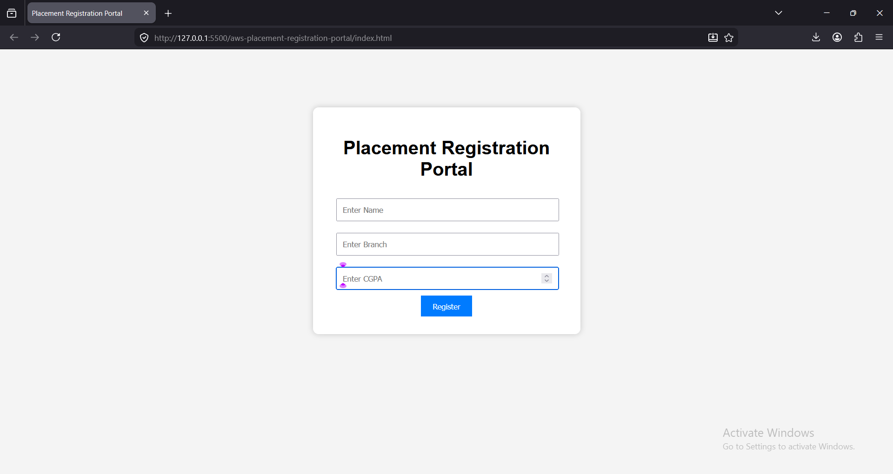
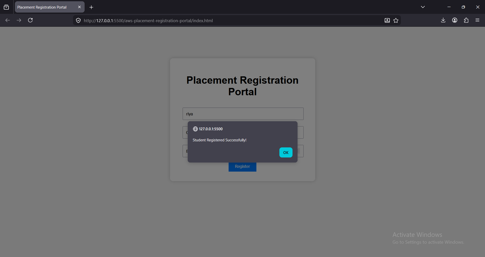
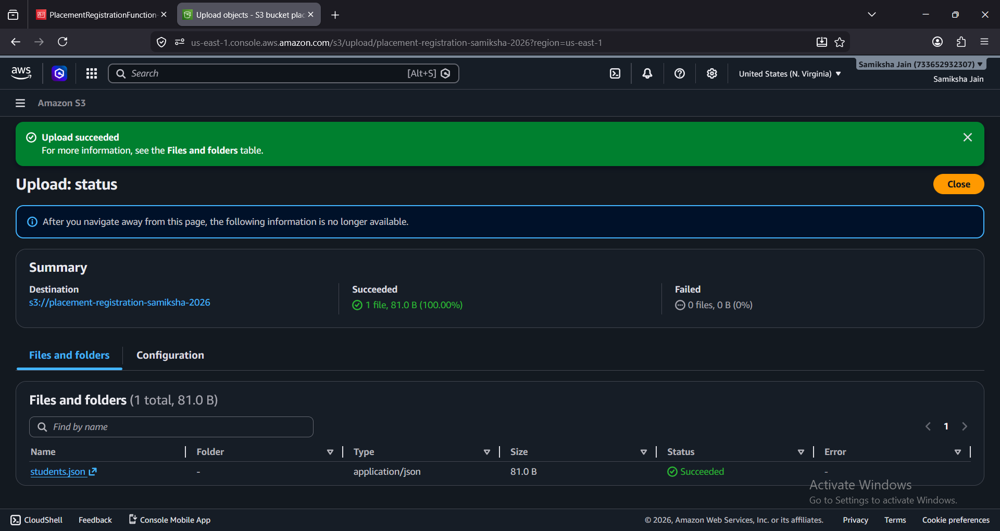
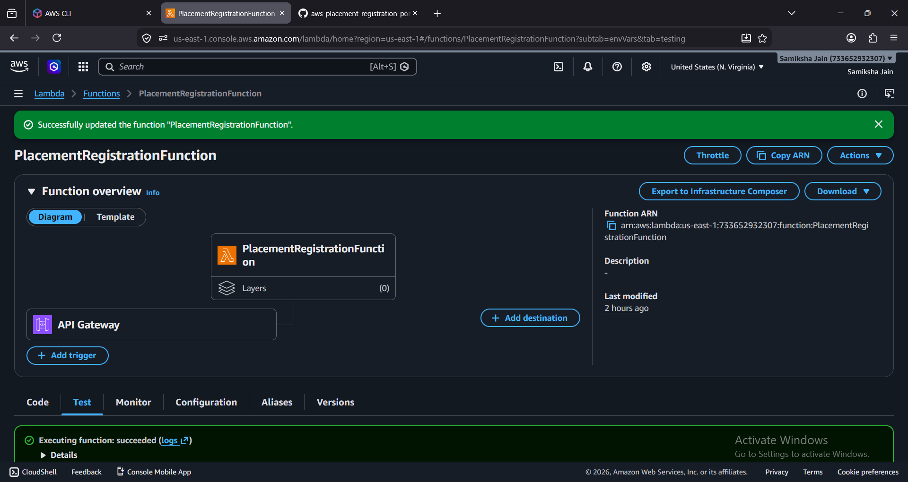
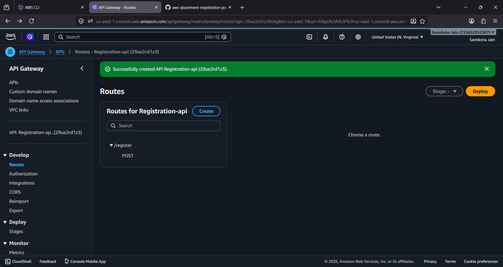
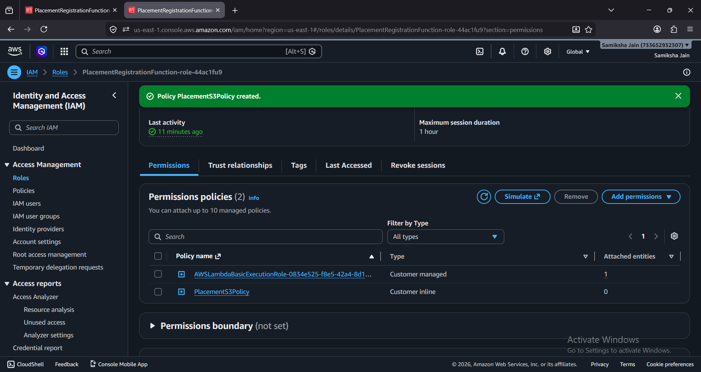

# 🚀 AWS Placement Registration Portal


A **Serverless Placement Registration Portal** built using **HTML, CSS, JavaScript, AWS Lambda, Amazon API Gateway, Amazon S3, and AWS IAM**.

This application enables students to register their placement details through a responsive web interface. The submitted information is securely processed by **AWS Lambda** and stored in a **JSON file in Amazon S3**, demonstrating a complete serverless architecture without relying on a traditional database.

---

# 📸 Preview



---

# 📖 Project Overview

This project demonstrates how multiple AWS services work together to build a scalable and cost-effective serverless web application.

## Workflow

1. Student enters registration details.
2. JavaScript sends the data to Amazon API Gateway.
3. API Gateway invokes an AWS Lambda function.
4. Lambda retrieves the existing `students.json` file from Amazon S3.
5. The new student record is appended.
6. The updated `students.json` file is uploaded back to Amazon S3.
7. Lambda returns a success response to the frontend.

---

# 🏗️ Architecture

```text
Student
   │
   ▼
HTML + CSS + JavaScript
   │
   ▼
Amazon API Gateway
   │
   ▼
AWS Lambda (Python)
   │
   ▼
Amazon S3 (students.json)
```

---

# ✨ Features

- Serverless architecture using AWS
- Responsive student registration form
- Real-time data submission
- REST API using Amazon API Gateway
- AWS Lambda backend
- Data stored in Amazon S3
- JSON-based storage
- IAM role-based security
- CORS enabled
- Lightweight and scalable architecture

---

# 🛠️ Technologies Used

## Frontend

- HTML5
- CSS3
- JavaScript (ES6)

## Backend

- Python
- Boto3

## AWS Services

- Amazon S3
- AWS Lambda
- Amazon API Gateway
- AWS IAM

---

# 📂 Project Structure

```text
aws-placement-registration-portal/
│
├── index.html
├── style.css
├── script.js
├── README.md
├── registration_portal.png
├── portal_after_registration.png
├── registered_data.png
├── s3_bucket.png
├── lambda_function.png
├── Api_gateway.png
└── IAM_roles.png
```

---

# 📸 Project Screenshots

## Registration Portal


## Successful Registration



## Registered Data Stored in Amazon S3


## Amazon S3 Bucket



## AWS Lambda Function



## Amazon API Gateway



## IAM Roles & Permissions



---

# ⚙️ AWS Services Used

## Amazon S3

- Stores the `students.json` file.
- Acts as a lightweight JSON-based storage solution.
- Automatically updates after every successful registration.

## AWS Lambda

### Responsibilities

- Receives requests from API Gateway.
- Retrieves the existing `students.json` file from Amazon S3.
- Appends the new student record.
- Uploads the updated JSON file back to Amazon S3.
- Returns a success response to the frontend.

## Amazon API Gateway

### Configuration

- Accepts HTTP POST requests.
- Invokes the AWS Lambda function.
- Enables CORS for browser communication.

## AWS IAM

Lambda is granted only the permissions it requires by following the **Principle of Least Privilege**.

Required permissions:

- `s3:GetObject`
- `s3:PutObject`
- `s3:ListBucket`

---

# 📄 Sample Request

```json
{
  "name": "Samiksha Jain",
  "branch": "Computer Science",
  "cgpa": "9.2"
}
```

---

# 📄 Sample Response

```json
{
  "message": "Student Registered Successfully!"
}
```

---

# 📄 Example Stored Data

```json
[
  {
    "name": "Samiksha Jain",
    "branch": "Computer Science",
    "cgpa": "9.2"
  },
  {
    "name": "Vaishali",
    "branch": "Information Technology",
    "cgpa": "8.8"
  }
]
```

---

# 📋 Prerequisites

Before running this project, ensure you have:

- AWS Account
- Amazon S3 Bucket
- AWS Lambda Function
- Amazon API Gateway
- IAM Role with S3 permissions
- Visual Studio Code
- Live Server Extension

---

# 🚀 Setup Instructions

## 1. Clone the Repository

```bash
git clone https://github.com/Samiksha711/aws-registration-portal.git
```

> Replace the repository URL if your GitHub repository has a different name.

## 2. Open the Project

Open the project in **Visual Studio Code**.

## 3. Configure AWS

- Create an Amazon S3 bucket.
- Upload the `students.json` file.
- Create an AWS Lambda function.
- Configure Amazon API Gateway.
- Attach an IAM role with S3 permissions.
- Enable CORS in API Gateway.
- Update the API Gateway Invoke URL inside `script.js`.

## 4. Run the Project

Install the **Live Server** extension in Visual Studio Code.

Right-click **index.html** and choose **Open with Live Server**.

---

# 📈 Future Enhancements

- User authentication using Amazon Cognito
- Admin dashboard
- Student search functionality
- Edit and delete student records
- Migration to Amazon DynamoDB
- Email notifications using Amazon SES
- Deployment using AWS Amplify

---

# 📚 Learning Outcomes

Through this project, I gained practical experience in:

- Building serverless applications
- AWS Lambda development
- REST API creation using Amazon API Gateway
- Working with Amazon S3
- IAM roles and permission management
- JSON data handling
- JavaScript Fetch API
- Frontend and backend integration
- Debugging cloud-based applications
- Understanding event-driven serverless architecture

---

# 👩‍💻 Author

**Samiksha Jain**

**B.Tech – Computer Science Engineering**

Aspiring Data Scientist | Python Developer | AWS & Cloud Computing Enthusiast

- **GitHub:** https://github.com/Samiksha711
- **LinkedIn:** https://www.linkedin.com/in/samikshajain11

---

# 📄 License

This project is licensed under the MIT License.

---

# ⭐ Support

If you found this project useful, please consider giving it a **⭐ Star** on GitHub.

Thank you for visiting this repository! 😊
